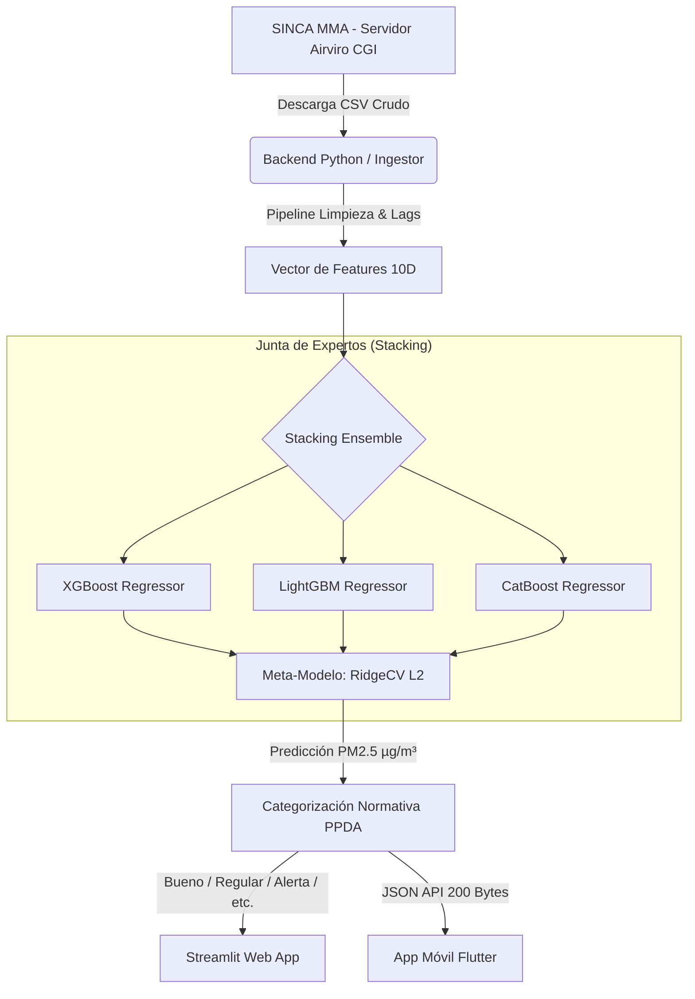
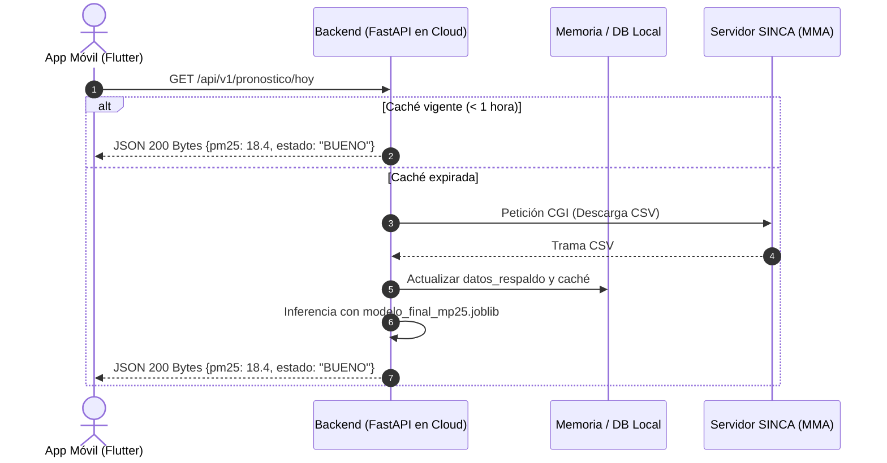

# Especificación de Arquitectura de Software & Machine Learning: Predictor PM2.5

**Proyecto:** Sistema Predictivo de Calidad del Aire (PM2.5) — Estación Parque O'Higgins (Código SINCA: 273)  
**Rol / Perspectiva:** Ingeniería de Software Senior / Staff Machine Learning Engineer  
**Repositorio GitHub:** [https://github.com/Drown0/PM2.5](https://github.com/Drown0/PM2.5)  
**Fecha de Actualización:** Septiembre 2026  

---

## 1. Resumen Ejecutivo y Arquitectura Global del Sistema

El proyecto implementa una solución integral de ingeniería de datos y aprendizaje automático para inferir con 24 horas de antelación los niveles de Material Particulado Fino (PM2.5) en la estación Parque O'Higgins (Santiago de Chile, ID SINCA: 273). El sistema ha transitado desde un repositorio académico exploratorio hacia una arquitectura desacoplada de nivel de producción que incluye:
1. **Capa de Ingesta Directa:** Sincronización en tiempo real con el servidor oficial del Ministerio del Medio Ambiente (MMA/SINCA).
2. **Capa de Procesamiento & Feature Engineering:** Transformación matemática autorregresiva, filtros móviles y transformaciones estacionales ortogonales.
3. **Capa de Modelado Heterogéneo (Stacking):** Ensamble de tres algoritmos líderes de Gradient Boosting (XGBoost, LightGBM, CatBoost) sintetizados por un meta-modelo lineal regularizado (RidgeCV).
4. **Capa de Producción Web:** Aplicación reactiva en Streamlit Cloud con caché en memoria (TTL = 1 hora) y tolerancia a fallos (*Circuit Breaker*).
5. **Capa Móvil Objetivo:** Diseño de microservicio backend REST en FastAPI para nutrir una app móvil nativa en Flutter.



---

## 2. Protocolo de Ingesta e Ingeniería Inversa de SINCA (Airviro APUB-MMA)

La plataforma oficial del SINCA (`sinca.mma.gob.cl`) opera internamente sobre el motor meteorológico **Airviro** (desarrollado por la firma sueca *Apertum IT AB*). Tras detectar que el endpoint histórico devolvía error HTTP 404, se aisló el servicio CGI nativo de despacho de series temporales:

```http
GET https://sinca.mma.gob.cl/cgi-bin/APUB-MMA/apub.tsindico2.cgi
```

### Parámetros de Consulta Requeridos (Query Parameters)
* `outtype=xcl`: Fuerza la exportación directa en formato CSV estructurado con cabecera `Content-Type: application/csv`.
* `macro=./RM/D14/Cal/PM25//PM25.diario.diario.ic`: Macro interna de Airviro que apunta a la estación Parque O'Higgins (D14), sensor de PM2.5, resolución diaria.
* `from=000101`: Fecha inicial en formato compacto `YYMMDD` (01 de enero de 2000).
* `to=260908`: Fecha final dinámica calculada con `datetime.now().strftime('%y%m%d')` (septiembre de 2026).
* `path=/usr/airviro/data/CONAMA/`: Ruta absoluta del directorio base en el servidor UNIX del Ministerio.
* `lang=esp`: Localización de rótulos a español.

### Manejo de Tipos y Parseo Robusto
1. El archivo utiliza `;` como delimitador de columnas y `,` como separador decimal.
2. Para evitar que Pandas interprete la columna `FECHA (YYMMDD)` como flotante (lo que provocaría pérdida de ceros iniciales como `000101` $\to$ `101.0`), se fuerza el tipo como string: `dtype={'FECHA (YYMMDD)': str}`.
3. Se aplica consolidación jerárquica de calidad: `Registros validados` $\to$ `Registros preliminares` $\to$ `Registros no validados`.

---

## 3. Pipeline de Preprocesamiento y Matemáticas de Feature Engineering

El modelo se alimenta de un vector de 10 características matemáticas optimizadas:

### 1. Variables Autorregresivas (Lags Temporales)
* `lag_1` $= \text{PM2.5}(t-1)$: Concentración de ayer. Captura la inercia química y estancamiento térmico inmediato.
* `lag_2` $= \text{PM2.5}(t-2)$: Concentración de anteayer. Modela la duración multidiaria de episodios críticos.
* `lag_3` $= \text{PM2.5}(t-3)$: Concentración de hace 3 días. Memoria base de la cuenca.

### 2. Filtros Estadísticos Móviles y Dispersión
* `rolling_mean_3`: Media móvil de 3 días pasados. Filtro pasa-bajos que elimina anomalías de lectura o ruidos de sensor.
* `rolling_std_3`: Desviación estándar muestral con factor de Bessel `ddof=1` ($s = \sqrt{\frac{1}{N-1}\sum (x_i - \bar{x})^2}$). Mide la volatilidad o inestabilidad atmosférica local.
* `rolling_mean_7`: Media móvil semanal. Línea base de acumulación crónica de aerosoles.

### 3. Dinámica Cinemática
* `diff_1` $= \text{lag}_1 - \text{lag}_2$: Derivada temporal discreta de primer orden. Informa al modelo la aceleración del fenómeno (contaminación en ascenso o en descenso).

### 4. Transformaciones Cíclicas Ortogonales (Estacionalidad Anual)
* $\text{mes\_sin} = \sin\left(\frac{2\pi \cdot \text{Mes}}{12}\right)$
* $\text{mes\_cos} = \cos\left(\frac{2\pi \cdot \text{Mes}}{12}\right)$  
Garantizan la continuidad circular entre diciembre y enero, modelando con exactitud los picos de invierno (mayo a agosto en Santiago).

### 5. Máscara de Actividad Humana (Antropogénica)
* `Es_FinDeSemana`: Variable binaria (1 si Sábado/Domingo, 0 si Lunes-Viernes). Modela la caída en emisiones por transporte público y paralización de faenas fabriles.

### Diagnóstico de Variables Físicas Ausentes (Humedad, Temperatura y Viento)
El modelo actual es **estrictamente autorregresivo univariado**. No utiliza variables meteorológicas como Humedad Relativa (%), Temperatura e Inversión Térmica (°C), ni Velocidad del Viento (km/h).  
* **Motivo arquitectónico:** Maximizar la disponibilidad del sistema eliminando dependencias de múltiples sensores ministeriales que presentan fallas frecuentes.
* **Impacto:** Explica el techo de precisión de $R^2 \approx 0.70$ y la *inercia de rezago* (el modelo tarda 24 horas en acusar el impacto de un frente meteorológico que entra a la cuenca).

---

## 4. Arquitectura del Modelo Predictivo: Stacking Ensemble Regressor

El sistema no confía en un estimador único, sino en una estructura de ensamble heterogéneo:

| Componente | Algoritmo | Hiperparámetros / Configuración | Función Arquitectónica |
|---|---|---|---|
| **Base Estimator 1** | **XGBoost Regressor** | `n_estimators=200`, `learning_rate=0.05`, `max_depth=5` | Capturar interacciones no lineales profundas y picos extremos de saturación. |
| **Base Estimator 2** | **LightGBM Regressor** | `n_estimators=200`, `learning_rate=0.05`, `verbosity=-1` | Aportar velocidad de inferencia y partición de árboles por hojas (*leaf-wise*). |
| **Base Estimator 3** | **CatBoost Regressor** | `n_estimators=200`, `learning_rate=0.05`, `depth=5`, `silent=True` | Árboles simétricos (*oblivious trees*) con alta resistencia al sobreajuste frente a variables cíclicas. |
| **Meta-Estimator** | **RidgeCV** | Regularización L2 con validación cruzada interna | Ponderar analíticamente los 3 estimadores base para minimizar la varianza global conjunta. |

---

## 5. Auditoría Técnica de Calidad y Correcciones Implementadas

1. **Erradicación de Data Leakage:** Sustitución de `KFold(cv=5)` aleatorio por partición secuencial temporal (`KFold(n_splits=5, shuffle=False)`) sobre el 80% histórico ordenado.
2. **Tratamiento de Outliers (Winsorización 1%-99%):** Valores limitados al rango $[6.0, 88.3]$ µg/m³, protegiendo a los árboles de decisión contra ruidos espurios o incendios forestales aislados sin descartar muestras.
3. **Diagnóstico Formal de Sobreajuste:**
   * $R^2 \text{ Train} = 0.6706$
   * $R^2 \text{ Test} = 0.6982$
   * $\text{Diferencia} = -0.0276 \implies$ **Cero sobreajuste**. Excelente capacidad de generalización.
4. **Métricas en Unidades Físicas:**
   * **MAE (Error Absoluto Medio):** `5.65 µg/m³` (error típico promedio).
   * **RMSE (Raíz del Error Cuadrático Medio):** `8.31 µg/m³`.
5. **Corrección de Grados de Libertad:** Se alineó el cálculo en producción a `np.std(..., ddof=1)` para coincidir exactamente con la fórmula muestral de `pandas` en entrenamiento.

---

## 6. Arquitectura de Producción Web en Streamlit

El servicio activo (`pm25-prediccion-del-aire.streamlit.app`) incorpora patrones de resiliencia:
* **Caché en Memoria con TTL (`@st.cache_data(ttl=3600)`):** Garantiza que la descarga desde SINCA se realice a lo más una vez por hora. Las solicitudes posteriores responden de forma instantánea en `< 0.05 s`.
* **Botón de Sincronización Forzada:** Ejecuta `fetch_sinca_raw.clear()` para purgar la caché y realizar una petición en vivo a demanda.
* **Patrón Circuit Breaker:** Si el portal de SINCA sufre una caída de red o mantenimiento, la aplicación conmuta automáticamente al archivo de contingencia `datos_respaldo.csv`. Cada descarga exitosa actualiza dicho archivo en segundo plano.

---

## 7. Arquitectura Objetivo para Aplicación Móvil (Roadmap)

Para materializar el producto móvil en iOS y Android, se adopta el patrón **Backend for Frontend (BFF)** y **Anti-Corruption Layer (ACL)**:



### Justificaciones de Ingeniería del Backend:
1. **Elusión de CORS:** SINCA no entrega cabeceras `Access-Control-Allow-Origin: *`. Un cliente web o app híbrida directa sería bloqueada por el navegador.
2. **Optimización de Payload:** El celular recibe **200 bytes** en vez de descargar **15 MB** de CSV crudo por sesión, ahorrando batería y datos móviles.
3. **Desacoplamiento Operativo:** Cualquier modificación de rutas en SINCA se absorbe en el backend sin requerir actualización de la app en Google Play o App Store.
4. **Demonio de Notificaciones Push:** El backend programa alertas diarias a las 20:00 hrs notificando al usuario si el día de mañana se prevé estado de Alerta, Pre-emergencia o Emergencia.
