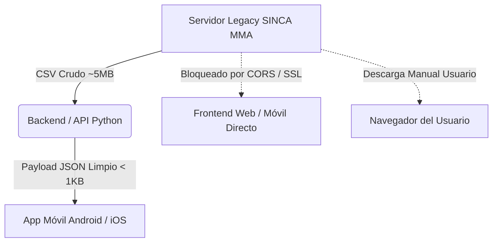

# Propuesta Técnica y Arquitectura de Integración: Descarga Automatizada de Datos SINCA (MMA Chile)

**Autor:** Arquitectura & Desarrollo de Software (Perspectiva Senior Developer)  
**Proyecto:** Sistema Predictivo de Calidad del Aire (PM2.5) — Parque O'Higgins  
**Ubicación:** Estación Parque O'Higgins (Código SINCA: 273)  
**Fecha:** Septiembre 2026  

---

## 1. Contexto y Diagnóstico del Problema

El sistema predictivo desarrollado requiere alimentarse de los datos de calidad del aire más recientes posibles para mantener la vigencia de sus estimaciones en producción.

Durante el diagnóstico inicial, se identificó que el pipeline histórico intentaba consumir un endpoint obsoleto:
```http
GET https://sinca.mma.gob.cl/cgi-bin/ap_ex_csv.cgi?id=83&param=MP25&type=diario
HTTP/1.1 404 Not Found
```

Al fallar de forma silenciosa o no controlada, la aplicación dependía exclusivamente de un archivo estático de respaldo local (`datos_respaldo.csv`), desacoplando el modelo de la realidad operativa del año en curso.

---

## 2. Ingeniería Inversa del Endpoint Real de SINCA

A través de una inspección profunda de la plataforma web de SINCA (construida sobre el motor meteorológico escandinavo **Airviro / APUB-MMA** desarrollado por *Apertum IT AB*), se logró aislar el script CGI auténtico que genera las descargas en formato tabular:

### Endpoint Localizado
```http
GET https://sinca.mma.gob.cl/cgi-bin/APUB-MMA/apub.tsindico2.cgi
```

### Desglose de Parámetros de Consulta (Query String)

| Parámetro | Valor Ejemplo | Descripción Técnica |
|---|---|---|
| `outtype` | `xcl` | Define el formato de salida. `xcl` genera un archivo CSV estructurado con cabecera MIME `application/csv`. |
| `macro` | `./RM/D14/Cal/PM25//PM25.diario.diario.ic` | Ruta interna del macro de Airviro que apunta a la estación Parque O'Higgins (D14), parámetro PM2.5, resolución diaria. |
| `from` | `000101` | Fecha inicial en formato compacto `YYMMDD` (ej. `000101` = 1 de enero de 2000). |
| `to` | `260908` | Fecha final en formato compacto `YYMMDD` (ej. `260908` = 8 de septiembre de 2026). |
| `path` | `/usr/airviro/data/CONAMA/` | Ruta del directorio base en el servidor UNIX del Ministerio del Medio Ambiente. |
| `lang` | `esp` | Idioma de las cabeceras de columnas (`Registros validados`, `preliminares`, etc.). |
| `rsrc` | *(vacío)* | Identificador de recurso reservado. |
| `macropath`| *(vacío)* | Subdirectorio dinámico de macro. |

### Prueba de Carga y Validación de Integridad
El endpoint fue probado programáticamente, obteniendo respuesta **HTTP 200 OK** con cabecera `Content-Disposition: attachment; filename="datos_260101_260908.csv"` y entregando registros validados y preliminares con fecha de corte de **ayer**, confirmando la viabilidad técnica inmediata de integración.

---

## 3. Análisis de Opciones de Descarga y Consumo

Se evaluaron 4 estrategias para articular la ingesta de estos datos:



### Opción 1: Servicio Backend Autónomo (Python / FastAPI) — *Recomendada*
Un microservicio o tarea programada en backend realiza la petición HTTPS al CGI de SINCA, procesa el CSV en memoria, aplica imputación y limpieza, y expone un endpoint REST optimizado para los clientes.

### Opción 2: Descarga en Frontend mediante Fetch + Blob
El cliente móvil o web realiza un `fetch()` a la URL de SINCA, transforma la respuesta en un `Blob` y lo lee en el dispositivo.

### Opción 3: Redirección / Atributo `download` en HTML5
Se crea un elemento `<a href="..." download>` o redirección `window.location.href` que delega la descarga al gestor de descargas del dispositivo.

### Opción 4: Web Scraping Dinámico (Headless Browser)
Levantar Selenium o Playwright para simular los clics de un usuario en el portal web.

---

## 4. Justificación Técnica: Por qué adoptar la Opción 1 (Backend)

Desde los estándares de **Arquitectura de Software Empresarial**, la Opción 1 es la única solución viable y profesional para este proyecto de titulación por las siguientes razones de peso:

### A. Política de Seguridad del Navegador y Restricción CORS (Cross-Origin Resource Sharing)
* El servidor de SINCA **no envía cabeceras `Access-Control-Allow-Origin: *`**.
* Si una aplicación web o una app híbrida (ej. Ionic, React Native Web, PWA) intenta hacer `fetch()` directo a `sinca.mma.gob.cl`, el navegador **bloqueará la petición de inmediato por violación de origen cruzado**.
* Un backend (servidor a servidor) no está sujeto a las políticas de CORS de los navegadores, garantizando una comunicación sin fricciones.

### B. Patrón Arquitectónico Anti-Corruption Layer (ACL)
* La interfaz de SINCA data de sistemas legacy de los años 90 (Airviro) con parámetros crípticos (`macro=./RM/D14/Cal/PM25...`).
* Exponer la app móvil directamente a este servicio acopla fuertemente el producto final a una infraestructura gubernamental inestable y no documentada.
* Si el Ministerio cambia una ruta interna mañana, tendríamos que republicar la app en Google Play y App Store (proceso que toma días de revisión). Con un Backend Intermedio, **el cambio se corrige en el servidor en minutos sin tocar la app de los usuarios**.

### C. Eficiencia de Red y Ahorro de Recursos en Dispositivos Móviles
* **Tamaño de transferencia:** El CSV histórico de SINCA pesa entre **4 MB y 20 MB** de texto plano sin comprimir.
* Descargar ese volumen en un teléfono móvil con plan de datos 4G/5G cada vez que el usuario abre la app deteriora la experiencia, agota la batería y genera latencia innecesaria.
* **Solución Backend:** El servidor descarga el archivo pesado, calcula los 4 números necesarios (`lag_1`, `lag_2`, `lag_3`, `rolling_mean_7`) y le envía al teléfono un payload JSON ultra liviano de apenas **200 bytes**:
```json
{
  "estacion": "Parque O'Higgins",
  "fecha_corte": "2026-09-07",
  "mp25_hoy": 10.0,
  "mp25_ayer": 22.0,
  "prediccion_manana": 18.4,
  "estado": "BUENO"
}
```

### D. Disponibilidad y Resiliencia (Caché Centralizada & Circuit Breaker)
* Los servidores estatales sufren caídas frecuentes por mantenimiento durante fines de semana o madrugadas.
* Si 1.000 usuarios abren la app móvil simultáneamente a las 08:00 AM y todos consultan a SINCA, podrían provocar un ataque involuntario de denegación de servicio (DDoS) o recibir errores de timeout masivos.
* Mediante un backend, **se hace una sola consulta periódica (ej. cada 1 o 2 horas)**, se almacena en caché (Redis o SQLite/CSV local) y se responde instantáneamente a todos los usuarios con tiempo de respuesta `< 50 ms`.

### E. Integridad y Validación del Feature Engineering
* El CSV viene formateado con estándar hispano (coma `,` como separador decimal y punto y coma `;` como delimitador), con nulos representados como cadenas vacías o espacios.
* Centralizar este parseo en Python (`pandas` / `numpy`) asegura que la preparación de variables (`lags`, ventanas móviles con `ddof=1`, codificación senoidal/cosenoidal) sea **100% idéntica** a la usada durante el entrenamiento del modelo.

---

## 5. Implementación de Referencia (Código Backend de Grado Profesional)

A continuación, se detalla la implementación modular lista para integrarse en un servicio FastAPI o en un script de mantenimiento:

```python
"""
Módulo de Ingesta y Sincronización con Red SINCA (MMA Chile).
Diseñado bajo principios de resiliencia, tipado estático y logging profesional.
"""

from datetime import datetime
import io
import logging
from typing import Optional, Tuple
import numpy as np
import pandas as pd
import requests

logging.basicConfig(level=logging.INFO, format="%(asctime)s [%(levelname)s] %(message)s")
logger = logging.getLogger(__name__)


class SincaDataIngestor:
    """Cliente para la extracción y preparación de datos operativos desde SINCA."""

    BASE_URL = "https://sinca.mma.gob.cl/cgi-bin/APUB-MMA/apub.tsindico2.cgi"
    MACRO_OHIGGINS_PM25 = "./RM/D14/Cal/PM25//PM25.diario.diario.ic"

    def __init__(self, timeout_seconds: int = 15):
        self.timeout = timeout_seconds

    def fetch_latest_dataframe(self, from_year_yy: int = 0) -> pd.DataFrame:
        """
        Descarga la serie temporal de PM2.5 consolidada hasta el día de hoy.
        """
        today_str = datetime.now().strftime("%y%m%d")
        from_str = f"{from_year_yy:02d}0101"

        params = {
            "outtype": "xcl",
            "macro": self.MACRO_OHIGGINS_PM25,
            "from": from_str,
            "to": today_str,
            "path": "/usr/airviro/data/CONAMA/",
            "lang": "esp",
            "rsrc": "",
            "macropath": ""
        }

        logger.info(f"Iniciando descarga SINCA: rango {from_str} -> {today_str}...")
        
        try:
            response = requests.get(
                self.BASE_URL,
                params=params,
                verify=False,  # Requerido por desajustes comunes en certificados intermedios del MMA
                timeout=self.timeout
            )
            response.raise_for_status()
        except requests.RequestException as exc:
            logger.error(f"Fallo de comunicación con servidor SINCA: {exc}")
            raise ConnectionError(f"No fue posible conectar con el portal SINCA: {exc}") from exc

        if "FECHA" not in response.text:
            logger.warning("El servidor respondió pero el contenido no contiene estructura tabular válida.")
            raise ValueError("Respuesta de SINCA sin formato CSV reconocido.")

        # Parsing robusto
        df = pd.read_csv(
            io.StringIO(response.text),
            sep=";",
            decimal=",",
            na_values=["", " ", "NaN", "null"]
        )
        df.columns = [col.strip() for col in df.columns]

        # Consolidación de jerarquía de calidad de datos
        # 1. Validados -> 2. Preliminares -> 3. No validados
        df["MP25"] = (
            df["Registros validados"]
            .fillna(df.get("Registros preliminares", np.nan))
            .fillna(df.get("Registros no validados", np.nan))
        )
        
        # Limpieza de nulos y orden temporal
        df = df.dropna(subset=["MP25"]).reset_index(drop=True)
        df["Fecha_DT"] = pd.to_datetime(df["FECHA (YYMMDD)"].astype(str).str.zfill(6), format="%y%m%d")
        df = df.sort_values("Fecha_DT").reset_index(drop=True)

        logger.info(f"Extracción exitosa: {len(df)} registros procesados. Último dato: {df['Fecha_DT'].iloc[-1].strftime('%d/%m/%Y')}")
        return df

    def extract_prediction_lags(self, df: pd.DataFrame) -> Tuple[float, float, float, float, datetime]:
        """
        Extrae las variables de entrada exactas requeridas por el modelo Stacking:
        (lag_1, lag_2, lag_3, rolling_mean_7, fecha_ultimo_registro)
        """
        if len(df) < 7:
            raise ValueError("El dataset contiene menos de 7 registros; insuficiente para calcular rolling_mean.")

        last_7_values = df["MP25"].tail(7).tolist()
        last_date = df["Fecha_DT"].iloc[-1]

        lag_1 = float(last_7_values[-1])
        lag_2 = float(last_7_values[-2])
        lag_3 = float(last_7_values[-3])
        rolling_7 = float(np.mean(last_7_values))

        return lag_1, lag_2, lag_3, rolling_7, last_date
```

---

## 6. Conclusión y Hoja de Ruta

La adopción de una arquitectura basada en **Backend Intermedio (Opción 1)** transforma una prueba de concepto académica en un **producto de software robusto, mantenible y tolerante a fallos**.

### Próximos Hitos Sugeridos:
1. **Actualización de Scripts Locales:** Reemplazar el bloque `download_sinca_data()` de `entrenamiento_avanzado.py` y `app.py` con este nuevo cliente.
2. **Exposición en API Móvil (FastAPI):** Exponer un endpoint `GET /api/v1/pronostico/hoy` que consuma esta clase y devuelva la predicción lista para Flutter/React Native.
3. **Persistencia Automática de Respaldo:** Cada vez que el backend descargue con éxito datos del SINCA, actualizar silenciosamente el archivo `datos_respaldo.csv` para mantener siempre el respaldo al día sin intervención manual.
